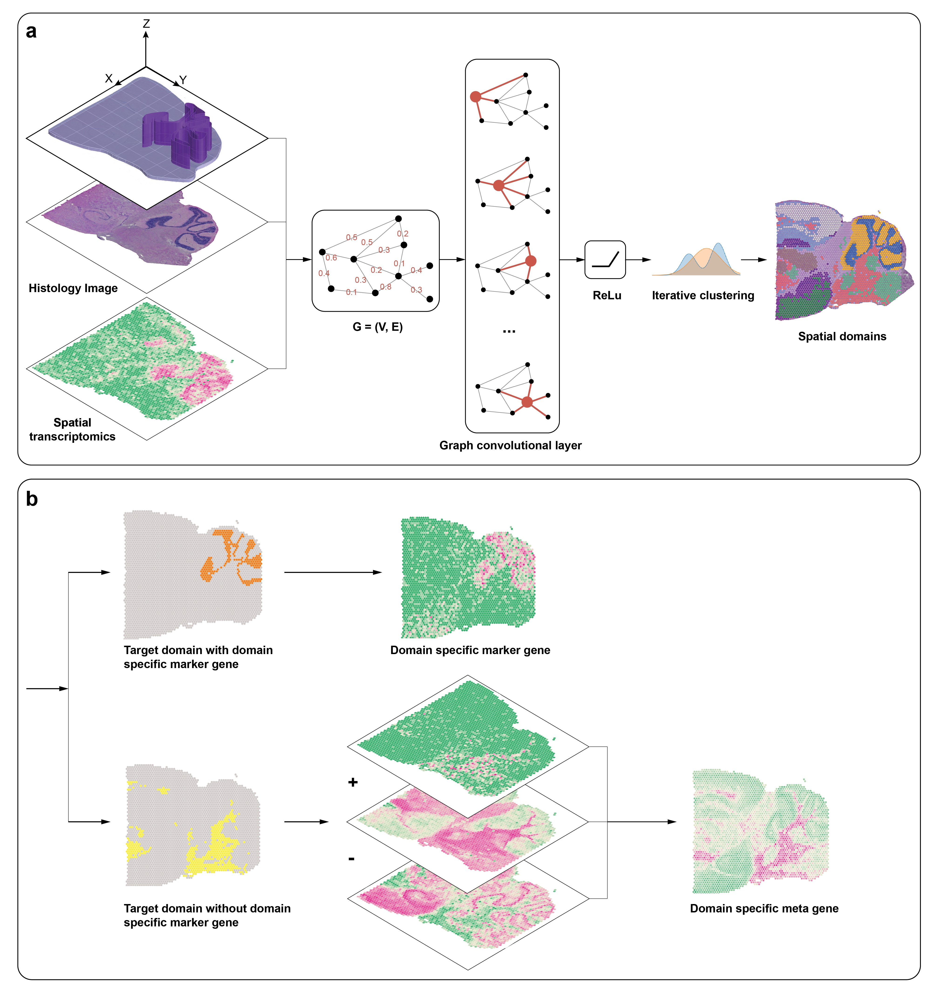

# Modified SpaGCN: 

This repository is based on the original [SpaGCN ](https://github.com/jianhuupenn/SpaGCN/tree/master/SpaGCN_package) implementation by **Jian Hu**, with modifications to extend its functionality.  
The modifications mainly adapt the workflow for the **DLPFC 12 slices** algorithm comparison.  

---

## Modifications in this repository  

To simplify the comparison across the **12 DLPFC slices**, this repository includes an automation script: [`run.py`](Master_Thesis_PCR/SpaGCN/run.py).  
This script executes the workflow step by step, calling the core modules of **stKeep** in sequence:  

- **Graph construction**
  - `calculate_adj_matrix(coords, ..., histology=False)`
  - Builds the **2-D spatial adjacency** from spot coordinates (optionally with histology-based weights).

- **Search spatial weight**
  - `search_l(p, adj, ...)  ->  l`
  - Converts the spatial smoothing proportion `p ∈ [0, 1]` into SpaGCN’s internal **`l` (lambda)**.

- **Resolution search (target number of domains)**
  - `search_res(adata, adj, l, n_clusters, ...)  ->  res`
  - Finds the **Louvain resolution** (`res`) that yields the requested `n_clusters` for initialization.

- **Model / training / prediction**
  ```python
  clf = SpaGCN()
  clf.set_l(l)
  clf.train(
      adata, adj,
      init_spa=True,      # use spatial structure at init
      init="louvain",     # initialize with Louvain clustering
      res=res,            # resolution returned by search_res
      num_pcs=50, 
      lr=0.005,
      max_epochs=200,
      opt="adam", # adam or sgd
      n_neighbors=10, #for louvain
      res=0.4, #for louvain
  )
  y_pred, prob = clf.predict()
  # store labels:
  adata.obs["pred"] = y_pred

### Usage
```bash
# Simply run and add the path to the .h5ad files for each sample:
python run.py
```

# Code Pull from original algorithm SpaGCN

## SpaGCN: Integrating gene expression, spatial location and histology to identify spatial domains and spatially variable genes by graph convolutional network

### Jian Hu*, Xiangjie Li, Kyle Coleman, Amelia Schroeder, Nan Ma, David J. Irwin, Edward B. Lee, Russell T. Shinohara, Mingyao Li*

SpaGCN is a graph convolutional network to integrate gene expression and histology to identify spatial domains and spatially variable genes. To jointly model all spots in a tissue slide, SpaGCN integrates information from gene expression, spatial locations and histological pixel intensities across spots into an undirected weighted graph. Each vertex in the graph contains gene expression information of a spot and the edge weight between two vertices quantifies their expression similarity that is driven by spatial dependency of their coordinates and the corresponding histology. To aggregate gene expression of each spot from its neighboring spots, SpaGCN utilizes a convolutional layer based on edge weights specified by the graph. The aggregated gene expression is then fed into a deep embedding clustering algorithm to cluster the spots into different spatial domains. After spatial domains are identified, genes that are enriched in each spatial domain can be detected by differential expression analysis between domains. SpaGCN is applicable to both in-situ transcriptomics with single-cell resolution (seqFISH, seqFISH+, MERFISH, STARmap, and FISSEQ) and spatial barcoding based transcriptomics (Spatial Transcriptomics , SLIDE-seq, SLIDE-seqV2, HDST, 10x Visium, DBiT-seq, Stero-seq, and PIXEL-seq) data. 


<br>
For thorough details, see the preprint: [Biorxiv](https://www.biorxiv.org/content/10.1101/2020.11.30.405118v1)
<br>

## Usage

The [**SpaGCN**](https://github.com/jianhuupenn/SpaGCN) package is an implementation of a garph convolutional network for spatial transcriptomics. With SpaGCN, you can:

- Preprocess spatial transcriptomics data from various formats.
- Build a graph convolutional network with deep iterative clustering algorithm to identify spatial domains
- identify spatially variable genes for each spatial domain.
- Create mete genes to mark each spatial domains


## Tutorial

For the step-by-step tutorial, please refer to: 
<br>
https://github.com/jianhuupenn/SpaGCN/blob/master/tutorial/tutorial.md
<br>
A Jupyter Notebook of the tutorial is accessible from : 
<br>
https://github.com/jianhuupenn/SpaGCN/blob/master/tutorial/tutorial.ipynb
<br>
Toy data and results can be downloaded at: 
<br>
https://drive.google.com/drive/folders/1zten54vkjorp26T4iD0ApQGa9ut5eY42?usp=sharing
<br>
Please install Jupyter in order to open this notebook.

#### New Features! EZ Mode SpaGCN now available.
For users who are new to Python, we provide an Easy Mode SpaGCN. The parameter setting and intermedium steps are simplified.
<br>
Important Notes: This easy mode ONLY have basic functions and is ONLY for analysis purpose.
<br>
For method comparison, debugging, customizing parameters, and checking intermedium outputs, please refer to the detailed tutorial above.
<br>
Easy Mode SpaGCN tutorial: 
<br>
https://github.com/jianhuupenn/SpaGCN/blob/master/tutorial/tutorial_ez_mode.md
<br>
Easy Mode SpaGCN Jupyter Notebook: 
<br>
https://github.com/jianhuupenn/SpaGCN/blob/master/tutorial/tutorial_ez_mode.ipynb
<br>


## System Requirements
Python support packages: igraph, torch, pandas, numpy, scipy, scanpy > 1.5, anndata, louvain, sklearn.

## Versions the software has been tested on
Environment 1:
- System: Mac OS 10.13.6
- Python: 3.7.0
- Python packages: pandas = 1.1.3, numpy = 1.18.1,numba=0.53.1 python-igraph=0.7.1,torch=1.5.1,louvain=0.6.1,scipy = 1.4.1, scanpy = 1.5.1, anndata = 0.6.22.post1, natsort = 7.0.1, sklearn = 0.22.1

Environment 2:
- System: Anaconda
- Python: 3.7.9
- Python packages: pandas = 1.1.3, numpy = 1.20.2, python-igraph=0.8.3, torch=1.6.0,louvain=0.7.0, scipy = 1.5.2, scanpy = 1.6.0, anndata = 0.7.4, natsort = 7.0.1, sklearn = 0.23.3

Environment 3:
- System: Anaconda
- Python: 3.8.8
- Python packages: pandas = 1.2.4, numpy = 1.19.1, python-igraph=0.9.1, torch=1.8.1, louvain=0.7.0, scipy = 1.6.3, scanpy = 1.7.2, anndata = 0.7.6, natsort = 7.1.1, sklearn = 0.24.2


## Contributing

Souce code: [Github](https://github.com/jianhuupenn/SpaGCN)  

We are continuing adding new features. Bug reports or feature requests are welcome. 

Last update: 06/19/2021, version 1.2.0


## References

Please consider citing the following reference:

- https://www.nature.com/articles/s41592-021-01255-8

<br>

